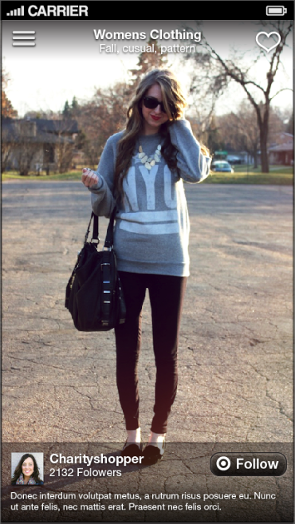
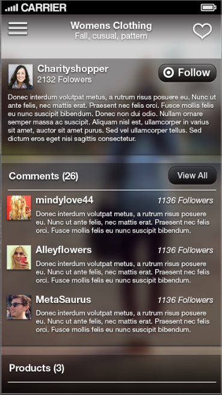
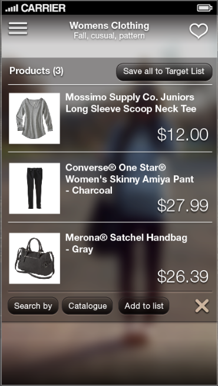
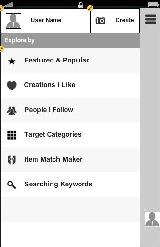
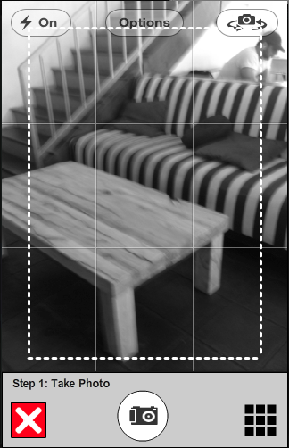
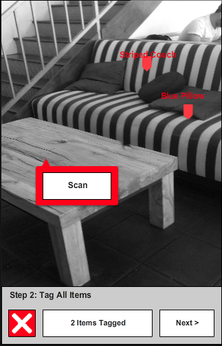

##Visuals of the TARGET LESS mobile experience 

*****

###Loading Screen

Animated loading splash page brands and helps set the tone for the user experience.  

*****

###Explore Mode

The App opens in Explore Mode showing popular or featured Creations by default or returning to view content based on the last used filters.  
**Swipe right and left** to browse through Creations that meet the filter criteria (noted at the top of the screen).   
**“Like” the Creation** in the upper right and “Follow” the Creator in the lower right.  The Creations that are more popular are presented first.  
**Swipe Up** to scroll the overlay Creation Details (next 2 screens below).

*****

###Swipe up on Creation to Explore Social Interaction

Presented first while swiping up on a selected Creation will show the description of the creation and a taste of shopper comments about this creation. 

*****

###Products in a LESS Creation

Further scrolling up will reveal a list of all the products used in this creation.  The shopper can immediately save all these items to their TargetList.  They can also tap on a particular product to just add that product to their TargetList, view the item in the Target Catalogue, or create a new Explore Filter based on that product.

*****

###Changing the Perspective - Navigation Drawer

In the upper left, pop open the navigation drawer have quick access to Explore Filter options as well as User Profile and Settings.  Prominently feature at the top is quick access to the “Create” button that launches the photo based create process.

*****

###The Creation Process

The create process starts with composing and taking a photo.

*****

###Tagging Products with Target Product Data

Once the photo is taken the user tags items in the photo by scanning barcodes or looking up items.  They complete the Creation by entering a brief description. Creations are automatically organized for Explore mode according to products that are in them as well as hash tags in the description.

*****