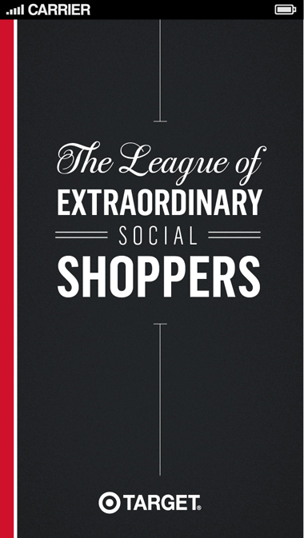
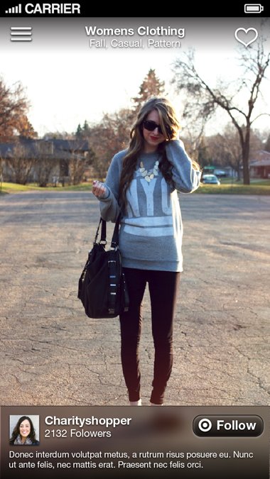
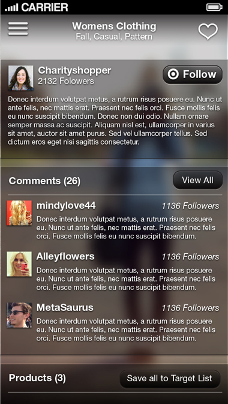
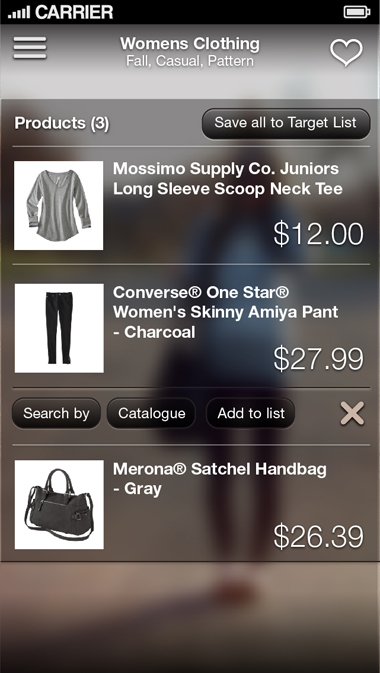
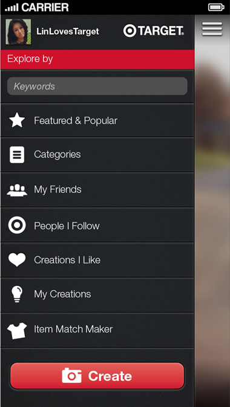
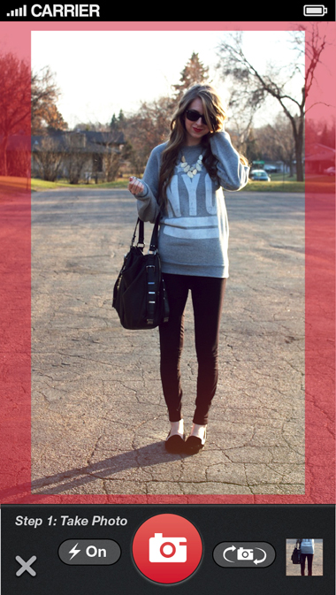
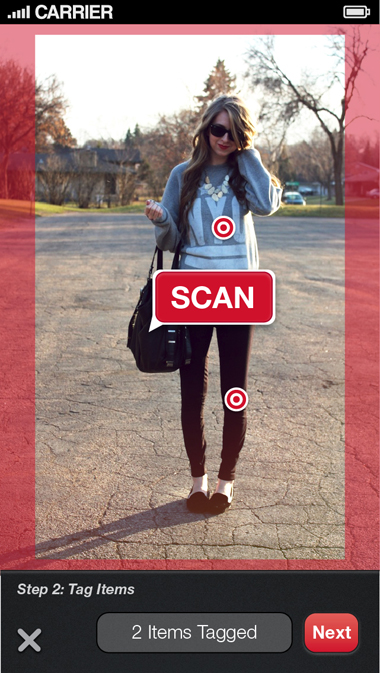
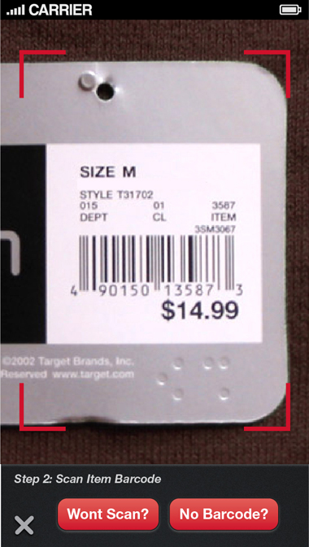

##Visuals of the TARGET LESS mobile experience 

*****

###THE LEAGUE - Branding & Loading Screen

Animated loading splash page brands and helps set the tone for the user experience. This is not your ordinary shopping list app...
*****

###EXPLORE - Product Creations generated by The League Community

The App opens in Explore Mode showing popular or featured Creations by default or returning to view content based on the last used filters. **Swipe right and left** to browse through Creations that meet the filter criteria (noted at the top of the screen). **“Like” the Creation** in the upper right and “Follow” the Creator in the lower right.  The Creations that are more popular are presented first. **Swipe Up** to scroll the overlay Creation Details (next 2 screens below).

*****

### *SWIPE UP* - To View the Social Interaction Around a Creation

Presented first while swiping up on a selected Creation will show the description of the creation and a taste of shopper comments about this creation. 

*****

###*SWIPE UP AGAIN* - Target Products Tagged in a Creation 

Further scrolling up will reveal a list of all the products used in this creation.  The shopper can immediately save all these items to their TargetList.  They can also tap on a particular product to just add that product to their TargetList, view the item in the Target Catalogue, or create a new Explore Filter based on that product.

*****

###*CHANGING PERSPECTIVE* - The Navigation Drawer

In the upper left, pop open the navigation drawer have quick access refining your Explore Feed, as well as User Profile and Settings.  Prominently featured at the bottom of the drawer, is the “Create” button that launches the photo based create process.

*****

###CREATE - The Creation Process

The create process starts with composing and taking a photo of your creation of various Target products.

*****

###IDENTIFYING - Products in a Photo

Once the photo is taken, the creator identify’s products in the photo by tapping on the approximate location.

*****

###TAGGING -  Products with Target SKU’s

The creator then scans product barcodes or looking up products in a hierarchical structure.  By identifying these relationships, the Explore modes can offer inspirational product combinations, created by The League users. 

*****